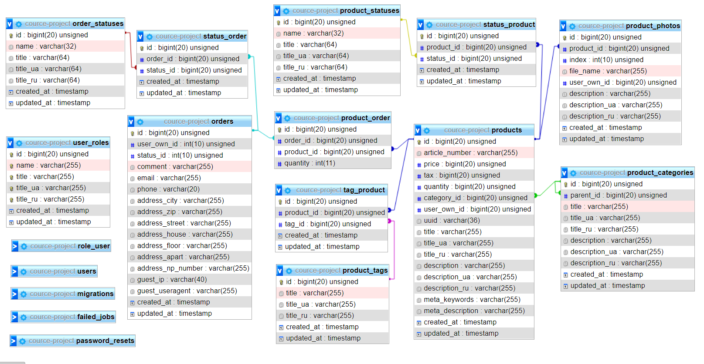

## **Курсовой проект по MVC**

### C использованием MVC-фреймворка Laravel 8.x на PHP.

#### Техническое Задание.

#### Статус - В процессе разработки

Создать интернет-магазин продукции.

==============================================================

##### **План контроллеров:**

<ul style="list-style:none;">
    <li>&#9989; ProductsController - контроллер для товаров</li>
    <li>&#10060; ProductCategoriesController - контроллер для категорий товаров</li>
    <li>&#10060; ProductTagsController - контроллер для тегов продуктов</li>
    <li>&#10060; ProductPhotosController - контроллер для фотографий продукта</li>
    <li>&#10060; OrdersController - контроллер для заказов</li>
    <li>&#10060; UsersController - контроллер для управления пользователями</li>
</ul>

==============================================================

##### **План Базы Данных:**

=====================

##### **Идей на будущее:**

<ul style="list-style:none;">
    <li>- в корзину/предзаказ/сообщить о наличии (подписка на оповещение по почте/телефону)</li>
    <li>- бренд продукта</li>
    <li>- купоны/промокоды/акции на продукцию или наборы</li>
    <li>- варианты количества/цвет/форма/набор/бандл</li>
    <li>- атрибуты продукта/товара</li>
    <li>- голосовалки/звездочки/рейтинг</li>
    <li>- жалобы</li>
    <li>- задать вопрос по товару</li>
    <li>- под-описание</li>
</ul>

==============================================================

