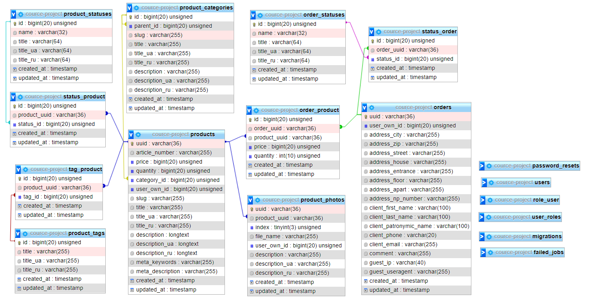

## **Курсовой проект по MVC**

### C использованием MVC-фреймворка Laravel 8.x на PHP и СУБД MySql.

#### Статус - превращен в дипломный проект в приватном репозитории и дорабатывается.

#### Техническое Задание.

Создать интернет-магазин продукции.

==============================================================

##### **План контроллеров:**

<ul style="list-style:none;" data-icon1="&#9989;">
    <li>&#9989; ProductsController - контроллер для товаров</li>
    <li>&#9989; ProductCategoriesController - контроллер для категорий товаров</li>
    <li>&#9989; ProductPhotosController - контроллер для фотографий продукта</li>
    <li>&#9989; OrdersController - контроллер для заказов</li>
    <li>&#9989; CartsController - контроллер для корзин</li>
</ul>

==============================================================

##### **План Базы Данных:**

=====================

==============================================================

